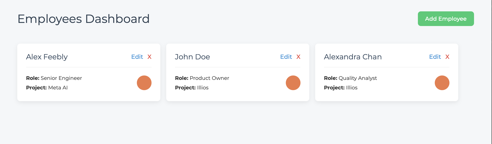

# Project Synapse - Employee Management Dashboard

A modern, client-side CRUD application for managing a list of employees, built with React. This project serves as a demonstration of core front-end development skills.

**Live Demo URL:** [Project Synapse](https://project-synapse-gray.vercel.app)

---



<!-- _(Note: To make this image work, you can create an `assets` folder in your project, put a screenshot inside, and link to it like `assets/screenshot.png`)_ -->

## About This Project

Project Synapse was built to showcase mastery of modern React development fundamentals. It's a single-page application (SPA) that allows users to perform Create, Read, Update, and Delete (CRUD) operations on an employee roster, all managed on the client-side. The goal was to build a clean, scalable, and professional front-end application from the ground up.

This project demonstrates proficiency in:

-   Building functional components with React.
-   Managing complex application state with the Context API.
-   Client-side routing with React Router.
-   Creating a professional and maintainable SCSS architecture.
-   Implementing version control with Git and GitHub.

## Tech Stack

-   **Framework:** React 18
-   **Build Tool:** Vite
-   **Routing:** React Router DOM v6
-   **State Management:** React Context API + `useState` hook
-   **Styling:** SCSS with BEM methodology
-   **Deployment:** Vercel

## Getting Started

To run this project locally:

1.  Clone the repository:
    ```bash
    git clone https://github.com/madouma/project-synapse.git
    ```
2.  Navigate to the project directory:
    ```bash
    cd project-synapse
    ```
3.  Install the dependencies:
    ```bash
    npm install
    ```
4.  Start the development server:
    ```bash
    npm run dev
    ```
